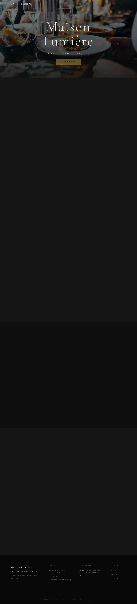

# Maison Lumière — Fine French Dining Website

A sophisticated, fully responsive single-page restaurant booking website for an upscale French restaurant. Built with vanilla HTML, CSS, and JavaScript — no frameworks, no build tools.

**Live Site:** https://openmind-walter.github.io/Training/  
**Repository:** https://github.com/openmind-walter/Training

## About

Maison Lumière is a demonstration of modern web design principles applied to a fine dining context. The site showcases a fully functional, single-page restaurant booking experience with no dependencies — just pure HTML, CSS, and vanilla JavaScript.

**Visit the live site:** [https://openmind-walter.github.io/Training/](https://openmind-walter.github.io/Training/)



This project demonstrates:
- Clean, semantic markup with full accessibility
- Responsive design without frameworks
- Client-side form validation and UX patterns
- Animation and interaction design
- Production-ready code organization

## 🎯 Features

- **Elegant hero section** with Unsplash background, animated text entrance, and smooth scroll navigation
- **Dynamic menu** with 9 dishes across 3 categories (Entrées, Plats Principaux, Desserts), each with food photography and hover effects
- **Auto-rotating testimonials carousel** with manual navigation and dot indicators
- **Fully functional reservation form** with client-side validation, error messaging, and success confirmation
- **Mobile-first responsive design** — optimized for mobile (480px), tablet (768px), and desktop (1024px+)
- **Accessibility first** — semantic HTML, ARIA labels, sufficient color contrast, form validation feedback
- **Smooth scroll animations** using IntersectionObserver for fade-in effects on scroll
- **Dark luxe palette** — deep charcoal, warm cream, and gold accents throughout

## 🚀 Quick Start

No build step required. Just open the file:

```bash
open index.html
```

Or run a local server:

```bash
# Python
python3 -m http.server 8080

# Node
npx serve .
```

Then visit `http://localhost:8080`

## 📋 Project Structure

```
.
├── index.html          # All markup — 5 sections + nav + footer
├── styles.css          # Complete styling with responsive breakpoints
├── script.js           # Nav, carousel, form validation, fade-in animations
├── CLAUDE.md           # Developer reference (design tokens, architecture notes)
└── README.md           # This file
```

## 🎨 Design & Styling

- **Typography**: Cormorant Garamond (headings) + Montserrat (body) via Google Fonts
- **Color palette**:
  - Background: `#0e0e0e` (deep charcoal)
  - Text: `#f5efe6` (warm cream)
  - Accent: `#c9a84c` (gold)
- **Layout**: Responsive CSS Grid and Flexbox with `clamp()` for fluid scaling
- **Animations**: CSS keyframes (hero entrance) + IntersectionObserver (scroll fade-ins)

See [CLAUDE.md](CLAUDE.md) for detailed design token reference.

## 📝 Form Validation

The reservation form validates all required fields client-side:

- **Name**: non-empty
- **Email**: valid email format
- **Phone**: non-empty
- **Date**: today or future only
- **Time**: must be selected
- **Guests**: 1–20 range

On success, displays: *"Thank you, {name}! Your reservation request for {guests} guest(s) on {date} at {time} has been received."*

## 📱 Responsive Breakpoints

| Breakpoint | Changes |
|---|---|
| Desktop (1024px+) | 4-column footer, 3-column dish grid, parallax hero |
| Tablet (768px) | Hamburger nav, 2-column footer, 1-column dish grid |
| Mobile (480px) | Fine-tuned typography and spacing |

## 🌐 Deployment

Deployed via **GitHub Actions** to GitHub Pages:

```
https://openmind-walter.github.io/Training/
```

The workflow (`.github/workflows/deploy.yml`) automatically deploys on every push to `main`. No manual steps required after initial Pages setup.

## 🛠 Development

All changes made to `index.html`, `styles.css`, or `script.js` are reflected immediately in the browser (refresh required). No compilation or build tools.

**Common tasks:**
- Add a dish: Copy a `<article class="dish-card">` block in [index.html](index.html)
- Change colors: Edit `:root` in [styles.css](styles.css)
- Add form field: Update HTML label + input, then add validation in [script.js](script.js)

See [CLAUDE.md](CLAUDE.md) for detailed guidance.

## ✅ Quality

- ✓ No console errors
- ✓ Full keyboard navigation support
- ✓ WCAG AA color contrast
- ✓ Semantic HTML with ARIA labels
- ✓ Mobile-tested at 375px, 768px, 1200px viewports
- ✓ Form validation tested (empty, invalid email, past date, etc.)

## 📄 License

Open source. Free to modify and use.
